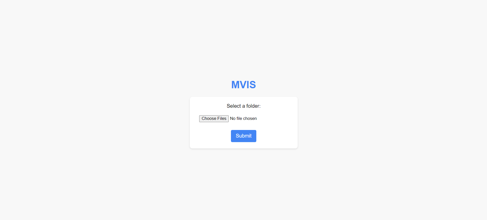

# Railway Defect Identification Using CNN Models

## Overview

This project focuses on the identification of defects in railway spring assemblies using Convolutional Neural Networks (CNN). The system is designed to detect missing or damaged spring assemblies in railway components. The project is divided into three main parts: the frontend, the backend with the detection and classification models, and the MERN stack-based UI.

## Project Structure

### 1. Frontend

The frontend of this application is built using the MERN stack (MongoDB, Express.js, React.js, Node.js). Users can upload video frame images through the UI, which are then processed by the backend models.

### 2. Backend

The backend is responsible for the core processing, which includes two main components:

-   **Spring Assembly Detector**:
    -   This component uses a fine-tuned YOLO (You Only Look Once) model to detect spring assemblies in the uploaded images.
    -   It identifies the springs, draws bounding boxes around them, crops the detected regions, and stores these cropped images for further analysis.
-   **Classification Model**:
    -   A custom model built using Keras with CNN architecture is used to classify the cropped spring images.
    -   The model categorizes the images into two classes: `Defected` or `Not Defected`.
    -   Images of defected springs are stored in the public folder, from where they can be accessed by the frontend for display.

### 3. MERN Stack UI

The MERN stack is utilized to create an intuitive user interface where users can:

-   Upload images of video frames.
-   View the defected spring images along with their names, which are fetched from the public folder after processing by the backend models.

## Workflow

1. **Upload**: Users upload images through the frontend UI.
2. **Detection**: The YOLO model processes the uploaded images, detects the springs, and crops them.
3. **Classification**: The cropped spring images are passed through the custom Keras CNN model, which classifies them as either `Defected` or `Not Defected`.
4. **Display**: Defected spring images are stored in a public folder and displayed on the frontend along with their names.

## Screenshots




## How to Run

1. **Clone the Repository**:

    ```bash
    git clone https://github.com/11aniketkumar/Railway-Defect-Identification
    cd Railway-Defect-Identification
    ```

2. **Install Dependencies**:

    ```bash
    npm install
    npm install nodemon
    ```

3. **Start the Development Servers**:

    - **Backend**:
        ```bash
        nodemon index.js
        ```
    - **Frontend**:
        ```bash
        npm start
        ```

4. **Access the Application**:
    - Open your browser and go to `http://localhost:5000`.

## Model Details

-   **Spring Assembly Detector (YOLO)**:

    -   A fine-tuned YOLO model is used for detecting and cropping spring assemblies from images.

-   **Classification Model (Custom Keras CNN)**:
    -   A custom CNN model built with Keras is used to classify the cropped images into `Defected` or `Not Defected`.

## Contributing

Contributions are welcome! Please create an issue or pull request if you would like to contribute to this project.

## License

This project is licensed under the MIT License. See the [LICENSE](LICENSE) file for details.
